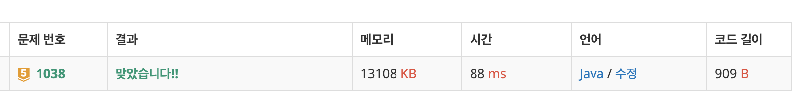

# 1038\_감소하는수




 num의 타입을 int로 쓰면 10자리 숫자인 ‘9876543210’은 처리하지 못한다. 이런 경우를 방지하기 위해 **long 타입을 사용**

3일 때는 `[3, 30, 31, 310, 32, 320, 321, 3210]` 의 감소하는 수

마지막 감소하는 수는 9876543210 이며, 이 수의 인덱스는 1022

```text
import java.io.BufferedReader;
import java.io.InputStreamReader;
import java.util.ArrayList;
import java.util.Collections;

public class Main {

	public static void main(String[] args) throws Exception {
		BufferedReader br = new BufferedReader(new InputStreamReader(System.in));

		int N = Integer.parseInt(br.readLine());
		int cnt = 10;

		ArrayList<Integer> list = new ArrayList<>();

		// 9876543210 이게 마지막 수
		for (int num = 0; num < 10; num++) {
			getDownNumber(num, 1, list);
		}

		// 정렬

		Collections.sort(list);
		
		if(N >=1023)
			System.out.println(-1);
		else
			System.out.println(list.get(N));

	}

	private static ArrayList getDownNumber(long num, int digit, ArrayList list) {
		if (digit > 10) {
			return list;
		}
		list.add(num);

		for (int i = 0; i < 10; i++) {
			if (num % 10 > i) {
				getDownNumber((num * 10) + i, digit + 1, list);
			}
		}
		return list;
	}

}

```

