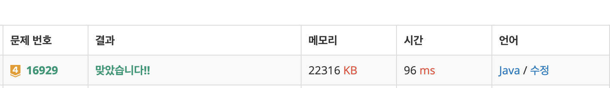

# 16929\_TwoDots

DFS문






```text
import java.io.*;
import java.util.*;

public class Main {
	static int[][] dxy = { { -1, 0 }, { 1, 0 }, { 0, -1 }, { 0, 1 } };
	static int N, M;
	static char[][] map;
	static boolean ans;

	public static void main(String[] args) throws IOException {
		BufferedReader br = new BufferedReader(new InputStreamReader(System.in));
		StringTokenizer st = new StringTokenizer(br.readLine());
		N = Integer.parseInt(st.nextToken());
		M = Integer.parseInt(st.nextToken());
		map = new char[N][M];
		ans = false;

		for (int i = 0; i < N; i++) {
			map[i] = br.readLine().toCharArray();
		}

		boolean[][] visited;
		for (int i = 0; i < N; i++) {
			for (int j = 0; j < M; j++) {
				if (!ans) {
					visited = new boolean[N][M];
					visited[i][j] = true;
					dfs(i, j, i, j, map[i][j], visited, 1);
				}
			}
		}
		System.out.println(ans ? "Yes" : "No");

	}

	private static void dfs(int x, int y, int sx, int sy, char color, boolean[][] visited, int cnt) {
		if (ans)
			return;

		for (int k = 0; k < 4; k++) {
			int nx = x + dxy[k][0];
			int ny = y + dxy[k][1];

			if (nx < 0 || nx >= N || ny < 0 || ny >= M)
				continue;
			// 색이 같고 사이클을 만들었고 처음위치
			if (map[nx][ny] == color && (nx == sx && ny == sy) && cnt >= 4) {
				ans = true;
				return;
			} else if (map[nx][ny] == color && !visited[nx][ny]) {
				visited[nx][ny] = true;
				dfs(nx, ny, sx, sy, color, visited, cnt + 1);
			}
		}
	}

}

```

