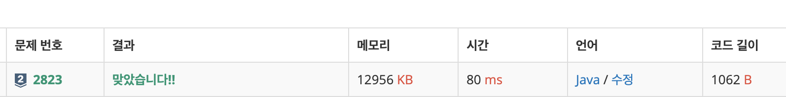

# 2823\_유턴싫어

BFS가 아니라 '유턴'에 집중 해서 풀것

현재 길에서 인접해 있는 길이 2개 이상이라면 유턴할 필요가 없다!

1개 이하인 길이면 유턴을 해야하므로 1을 출





```text

import java.io.BufferedReader;
import java.io.IOException;
import java.io.InputStreamReader;
import java.util.StringTokenizer;

public class Main{
	static int R, C;
	static int[][] dxy = { { -1, 0 }, { 1, 0 }, { 0, -1 }, { 0, 1 } };

	public static void main(String[] args) throws IOException {
		BufferedReader br = new BufferedReader(new InputStreamReader(System.in));
		StringTokenizer st = new StringTokenizer(br.readLine());
		R = Integer.parseInt(st.nextToken());
		C = Integer.parseInt(st.nextToken());

		char[][] map = new char[R][C];
		for (int i = 0; i < R; i++) {
			map[i] = br.readLine().toCharArray();

		}
		int ans = 0;
		for (int i = 0; i < R; i++) {
			for (int j = 0; j < C; j++) {
				if (map[i][j] == 'X')
					continue;
				int path = 0;
				for (int k = 0; k < 4; k++) {
					int nx = i + dxy[k][0];
					int ny = j + dxy[k][1];

					if (nx < 0 || ny < 0 || nx >= R || ny >= C) 
						continue;
					if(map[nx][ny]=='.')
						path++;

				}
				if (path <=1) {
					ans = 1;
					break;
				}
			}
		}
		System.out.println(ans);


	}


}

```

