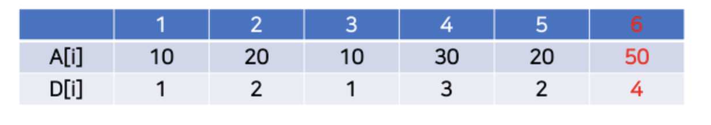
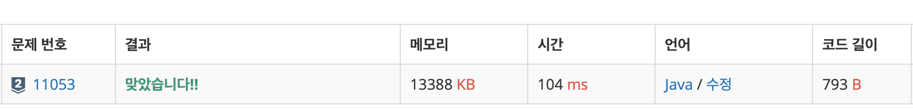

# 11053\_가장긴증가하는부분수열

DP\(다이나믹 프로그래밍\) : 중요한 것은 규칙을 찾거나 어떤 일반식을 찾는 것이 포인트








```text
import java.io.BufferedReader;
import java.io.IOException;
import java.io.InputStreamReader;
import java.util.StringTokenizer;

public class Main {

	public static void main(String[] args) throws IOException {
		BufferedReader br = new BufferedReader(new InputStreamReader(System.in));
		int N = Integer.parseInt(br.readLine());
		StringTokenizer st = new StringTokenizer(br.readLine());
		int[] arr = new int[N];
		for (int i = 0; i < N; i++) {
			arr[i] = Integer.parseInt(st.nextToken());
		}
		int[] dp = new int[N];
		dp[0] = 1;
		for (int i = 1; i < N; i++) {
			dp[i] = 1;
			for (int j = 0; j < i; j++) {
				if (arr[j] < arr[i] && dp[i] <= dp[j]) {
					dp[i] = dp[j] + 1;
				}
			}
		}
		int max = 0;
		for(int d: dp)
			max = Math.max(max, d);
		
		System.out.println(max);

	}

}

```

