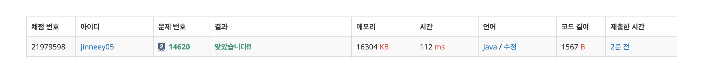

# 14620\_꽃길

백트래킹 문제







```text
import java.io.BufferedReader;
import java.io.IOException;
import java.io.InputStreamReader;
import java.util.StringTokenizer;

public class Main_14620_꽃길 {
	static int N;
	static int[][] map;
	static boolean[][] visited;
	static int[][] dxy = { { -1, 0 }, { 1, 0 }, { 0, 0 }, { 0, -1 }, { 0, 1 } };

	public static void main(String[] args) throws IOException {
		BufferedReader br = new BufferedReader(new InputStreamReader(System.in));
		StringTokenizer st;
		N = Integer.parseInt(br.readLine());

		map = new int[N][N];
		visited = new boolean[N][N];

		for (int i = 0; i < N; i++) {
			st = new StringTokenizer(br.readLine());
			for (int j = 0; j < N; j++) {
				map[i][j] = Integer.parseInt(st.nextToken());
			}
		}
		dfs(0, 0, 1);
		System.out.println(ans);

	}

	static int ans = Integer.MAX_VALUE;

	private static void dfs(int diff, int cnt, int x) {
		if (cnt == 3) {
			ans = Integer.min(ans, diff);
			return;
		}

		for (int i = x; i < N - 1; i++) {
			for (int j = 1; j < N - 1; j++) {
				if(!isRange(i, j))
					continue;
				int sum = 0;
				for (int k = 0; k < 5; k++) {
					visited[i + dxy[k][0]][j + dxy[k][1]] = true;
					sum += map[i + dxy[k][0]][j + dxy[k][1]];
				}

				dfs(diff + sum, cnt + 1, i);

				for (int k = 0; k < 5; k++) {
					visited[i + dxy[k][0]][j + dxy[k][1]] = false;
				}

			}
		}

	}

	private static boolean isRange(int x, int y) {
		for (int k = 0; k < 5; k++) {
			int nx = x + dxy[k][0];
			int ny = y + dxy[k][1];
			if (x < 0 || x >= N || y < 0 || y >= N || visited[nx][ny])
				return false;
		}
		return true;
	}

}

```

