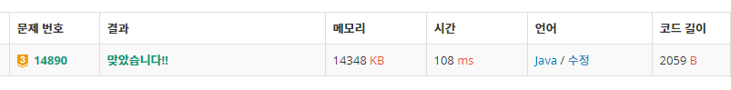

# 14890\_경사로

 구현문제





```text
import java.io.BufferedReader;
import java.io.IOException;
import java.io.InputStreamReader;
import java.util.StringTokenizer;

public class Main {
	static int N, L;
	static int[][] map;

	public static void main(String[] args) throws IOException {
		BufferedReader br = new BufferedReader(new InputStreamReader(System.in));
		StringTokenizer st = new StringTokenizer(br.readLine());
		N = Integer.parseInt(st.nextToken());
		L = Integer.parseInt(st.nextToken());

		map = new int[N][N];

		for (int i = 0; i < N; i++) {
			st = new StringTokenizer(br.readLine());
			for (int j = 0; j < N; j++) {
				map[i][j] = Integer.parseInt(st.nextToken());
			}
		}

	
		// 높이가 같아야한다, 같지 않다면 높이가 1차이가 나고 L만큼 같은 높이
		int ans = 0;
		for (int i = 0; i < N; i++) {
			// 가로 검사
			if (solve(i, 0, 0))
				ans++;

			// 세로검사
			if (solve(0, i, 1))
				ans++;

		}
		System.out.println(ans);
	}

	static int ans = 0;

	// d : 0 -> 가로검사 , d:1 -> 세로검사
	private static boolean solve(int x, int y, int d) {

		int[] height = new int[N];
		boolean[] visited = new boolean[N];

		for (int i = 0; i < N; i++) {
			height[i] = (d == 0) ? map[x][y + i] : map[x + i][y];
		}

		for (int i = 0; i < N - 1; i++) {
			// 같으면 패스
			if (height[i] == height[i + 1])
				continue;
			// 높이가 1보다 크다면 실패
			if (Math.abs(height[i] - height[i + 1]) > 1)
				return false;

			// 내려가는 경우
			if (height[i] - 1 == height[i + 1]) {
				for (int j = i + 1; j <= i + L; j++) {
					// j가 범위가 벗어나거나 같은 높이가 아니거나 이미 경사로가 있다면
					if (j >= N || height[i + 1] != height[j] || visited[j])
						return false;
					visited[j] = true;

				}
			}

			// 올라가야하는경우
			else if (height[i] + 1 == height[i + 1]) {
				for (int j = i; j > i - L; j--) {
					if (j < 0 || height[i] != height[j] || visited[j])
						return false;
					visited[j] = true;
				}
			}

		}
		return true;

	}
}
```


