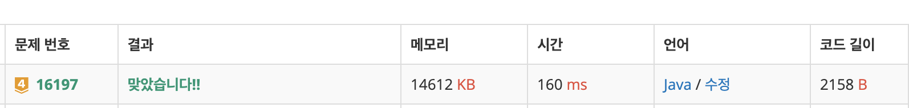

# 16197\_두 동전

//백트래킹, 브루트포






\*\*\*\*

**DFS는 최단거리를 보장하지 않기 때문에 더 짧은 거리가 있음에도 불구하고 방문체크를 하게되면 먼저 방문한 경로 때문에 더 짧은 경로를 탐색하지 않게 된다.**

**-&gt; 방문체크하면 안된**

1. 두 동전이 모두 떨어진 경우
2. 한 동전만 떨어진 경우
3. 두 동전이 모두 떨어지지 않은 경우 3-1. 두 동전이 모두 벽에 부딪힌 경우 3-2. 한 동전이 벽에 부딪힌 경우 3-3. 두 동전이 모두 벽에 부딪히지 않은 경우

```text
import java.io.BufferedReader;
import java.io.IOException;
import java.io.InputStreamReader;
import java.util.StringTokenizer;

public class Main_16197_두동전 {
	static int N, M;
	static char[][] map;
	static int[][] dxy = { { -1, 0 }, { 1, 0 }, { 0, -1 }, { 0, 1 } };
	static int ans = Integer.MAX_VALUE;

	public static void main(String[] args) throws IOException {
		BufferedReader br = new BufferedReader(new InputStreamReader(System.in));
		StringTokenizer st = new StringTokenizer(br.readLine());
		N = Integer.parseInt(st.nextToken());
		M = Integer.parseInt(st.nextToken());
		int fx = -1, fy = 0, sx = 0, sy = 0;
		map = new char[N][M];

		for (int i = 0; i < N; i++) {
			map[i] = br.readLine().toCharArray();
			for (int j = 0; j < M; j++) {
				if (map[i][j] == 'o') {
					if (fx == -1) {
						fx = i;
						fy = j;
					} else {
						sx = i;
						sy = j;
					}
				}
			}
		}
		solve(fx, fy, sx, sy, 0);
		System.out.println(ans == Integer.MAX_VALUE ? -1 : ans);

	}

	// 떨어질수없거나 열번보다 더 많으면 -1
	private static void solve(int fx, int fy, int sx, int sy, int cnt) {
		if (cnt>=ans || cnt >= 10) {
			return;
		}
		for (int k = 0; k < 4; k++) {
			boolean fdrop = false;
			boolean sdrop = false;
			
			int nfx = fx + dxy[k][0];
			int nfy = fy + dxy[k][1];

			int nsx = sx + dxy[k][0];
			int nsy = sy + dxy[k][1];

			if (!isRange(nfx, nfy))
				fdrop = true;
			
			if (!isRange(nsx, nsy))
				sdrop = true;

			// 둘다 떨어진 경우
			if (fdrop && sdrop)
				continue;

			// 하나만 떨어진 경우

			if (fdrop || sdrop) {
				ans = Math.min(ans, cnt + 1);
				return;
			}

			// 다음 위치가 벽이면 움직이지 않는다.
			if (!fdrop && map[nfx][nfy] == '#') {
				nfx = fx;
				nfy = fy;
			}
			if (!sdrop && map[nsx][nsy] == '#') {
				nsx = sx;
				nsy = sy;
			}

			// 두 동전이 겹친경우
			if ((nfx == nsx) && (nfy == nsy))
				continue;
			// 하나도 떨어지지 않는 경우-> 계속 하는 경우
			solve(nfx, nfy, nsx, nsy, cnt + 1);
		}

	}

	private static boolean isRange(int x, int y) {
		if (x < 0 || x >= N || y < 0 || y >= M)
			return false;
		else
			return true;
	}

}

```

