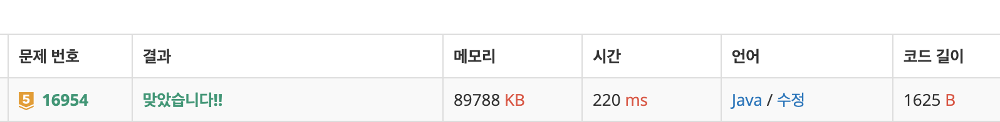

# 16954\_움직이는미로탈출

BFS문제

 움직일수 있는 모든 경우의 수를 욱제캐릭터가 움직이고 나서 Map을 이동해야함 그래서 que.size를 지정해두

ㅡ






```text
import java.io.*;
import java.util.*;

public class Main{
	static int N = 8;
	static boolean ans = false;
	static int[][] dxy = { { -1, 0 }, { 1, 0 }, { 0, -1 }, { 0, 1 }, { -1, -1 }, { -1, 1 }, { 1, -1 }, { 1, 1 },
			{ 0, 0 } };

	public static void main(String[] args) throws Exception {
		BufferedReader br = new BufferedReader(new InputStreamReader(System.in));
		char[][] map = new char[N][N];
		for (int i = 0; i < N; i++) {
			map[i] = br.readLine().toCharArray();
		}
		solve(N - 1, 0, map);
		System.out.println(ans == true ? 1 : 0);
	}

	private static void solve(int x, int y, char[][] map) {
		Queue<int[]> que = new LinkedList<>();
		que.add(new int[] { x, y });
		
		while (!que.isEmpty()) {
			int size = que.size();
			for (int s = 0; s < size; s++) {
				int[] cur = que.poll();
                
				if (map[cur[0]][cur[1]] == '#')
					continue;
                
				if (cur[0] == 0 && cur[1] == N - 1) {
					ans = true;
					return;
				}
				for (int k = 0; k < 9; k++) {
					int nx = cur[0] + dxy[k][0];
					int ny = cur[1] + dxy[k][1];

					if (!isRange(nx, ny))
						continue;
					
					if (map[nx][ny] != '#')
						que.add(new int[] { nx, ny });
					
					if(nx == 0 && ny == N-1) {
						ans = true;
						return;
					}
				}
			}
			map = move(map);
		}

	}

	private static char[][] move(char[][] map) {
		char[][] copy = new char[N][N];
		Arrays.fill(copy[0], '.');
		for (int i = N - 1; i >= 1; i--) {
			copy[i] = map[i - 1];
		}
		return copy;
	}

	private static boolean isRange(int x, int y) {
		if (x < 0 || x >= N || y < 0 || y >= N)
			return false;
		else
			return true;
	}

}

```

