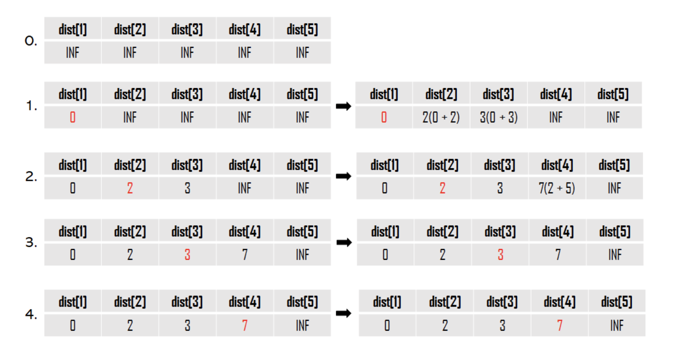

# 17153\_최단경로\(다익스트라\)







```text

import java.io.*;
import java.util.*;

public class Main{
	static class Node implements Comparable<Node> {
		int e, w;

		public Node(int e, int w) {
			this.e = e;
			this.w = w;
		}

		@Override
		public int compareTo(Node o) {
			// TODO Auto-generated method stub
			return this.w - o.w;
		}
	}

	static List<Node>[] list;
	static int[] dist;
	static int V, E;
	static int INF = 987654321;

	public static void main(String[] args) throws IOException {
		BufferedReader br = new BufferedReader(new InputStreamReader(System.in));
		StringTokenizer st = new StringTokenizer(br.readLine());
		V = Integer.parseInt(st.nextToken());
		E = Integer.parseInt(st.nextToken());
		int K = Integer.parseInt(br.readLine());
		list = new ArrayList[V + 1];
		dist = new int[V + 1];
		Arrays.fill(dist, INF);
		// 초기화
		for (int i = 1; i <= V; i++) {
			list[i] = new ArrayList<>();
		}
		for (int i = 0; i < E; i++) {
			st = new StringTokenizer(br.readLine());
			int s = Integer.parseInt(st.nextToken());
			int e = Integer.parseInt(st.nextToken());
			int w = Integer.parseInt(st.nextToken());
			list[s].add(new Node(e, w));
		}
		dijkstra(K);
		
		for(int i=1;i<=V;i++) {
			if(dist[i] == INF)
				System.out.println("INF");
			else
				System.out.println(dist[i]);
		}

	}

	private static void dijkstra(int start) {
		PriorityQueue<Node> pq = new PriorityQueue<>();
		boolean[] check = new boolean[V + 1];
		pq.add(new Node(start, 0));
		dist[start] = 0;

		while (!pq.isEmpty()) {
			Node cur = pq.poll();
			//아직 검사하지 않았고 최솟값을 기준으로 갈 수 있는 노드 
			if (check[cur.e])
				continue;
			check[cur.e] = true;
			
			for (Node node : list[cur.e]) {
				if(dist[node.e]>dist[cur.e]+node.w) {
					dist[node.e] = dist[cur.e]+node.w;
					pq.add(new Node(node.e,dist[node.e]));
				}
			}
		}
	}

}

```

