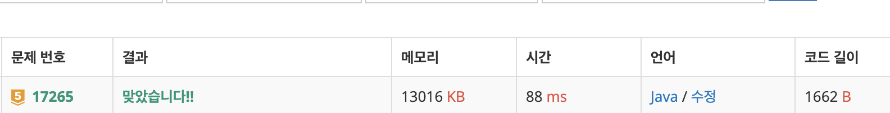

# 17265\_나의인생에는수학과함께

 dfs








```text
import java.io.BufferedReader;
import java.io.InputStreamReader;
import java.util.StringTokenizer;

public class Main {
	static int N;
	static int[][] dxy = { { 0, 1 }, { 1, 0 } };
	static String[][] map;

	public static void main(String[] args) throws Exception {
		BufferedReader br = new BufferedReader(new InputStreamReader(System.in));
		StringTokenizer st;
		N = Integer.parseInt(br.readLine());
		map = new String[N][N];
		for (int i = 0; i < N; i++) {
			st = new StringTokenizer(br.readLine());
			for (int j = 0; j < N; j++) {
				map[i][j] = st.nextToken();
			}
		}
		solve(0, 0, null, Integer.parseInt(map[0][0]));
		
		System.out.println(max +" "+min);

	}

	static int max = Integer.MIN_VALUE;
	static int min = Integer.MAX_VALUE;

	// 최단거리
	private static void solve(int x, int y, String oper, int result) {
		

		for (int k = 0; k < 2; k++) {
			int nx = x + dxy[k][0];
			int ny = y + dxy[k][1];

			if (nx < 0 || nx >= N || ny < 0 || ny >= N)
				continue;

			if (map[nx][ny].equals("+")) {
				solve(nx, ny, "+", result);
			} else if (map[nx][ny].equals("-")) {
				solve(nx, ny, "-", result);
			} else if (map[nx][ny].equals("*")) {
				solve(nx, ny, "*", result);
			} else { // 숫자라면
				int sum=0;
				if (oper.equals("+"))
					sum =  result + Integer.parseInt(map[nx][ny]);
				else if (oper.equals("-"))
					sum =  result - Integer.parseInt(map[nx][ny]);
				else if (oper.equals("*"))
					sum =  result * Integer.parseInt(map[nx][ny]);
				
				if (nx == N - 1 && ny == N - 1) {
					max = Math.max(max, sum);
					min = Math.min(min, sum);

					return;
				}
				solve(nx, ny, map[nx][ny],sum);
			}

		}

	}

}

```

