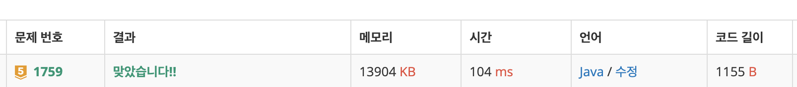

# 1759\_암호만들기


 조합문제





```text
import java.io.BufferedReader;
import java.io.IOException;
import java.io.InputStreamReader;
import java.util.Arrays;
import java.util.StringTokenizer;

public class Main {
	static int L, C;
	static char[] arr;
	static int[] result;

	public static void main(String[] args) throws IOException {
		BufferedReader br = new BufferedReader(new InputStreamReader(System.in));
		StringTokenizer st = new StringTokenizer(br.readLine());
		L = Integer.parseInt(st.nextToken());
		C = Integer.parseInt(st.nextToken());
		// 최소 두개의 자음 ,최소 한개의 모음
		String[] input = br.readLine().split(" ");
		arr = new char[C];
		result = new int[C];
		for (int i = 0; i < C; i++)
			arr[i] = input[i].charAt(0);
		Arrays.sort(arr);
		solve(0, 0, 0, 0);

	}

	private static void solve(int start, int depth, int ja, int mo) {
		if (depth == L && ja >= 2 && mo >= 1) {
			for (int i = 0; i < C; i++) {
				if (result[i] == 1)
					System.out.print(arr[i]);
			}
			System.out.println();
			return;
		}
		for (int i = start; i < C; i++) {
			result[i]  = 1;
			solve(i+1, depth+1, ja+(!check(arr[i])?1:0), mo+(check(arr[i])?1:0));
			result[i] = 0;
		}

	}

	private static boolean check(char ch) {
		if (ch == 'a' || ch == 'e' || ch == 'i' || ch == 'o' || ch == 'u')
			return true;
		else
			return false;
	}

}

```

