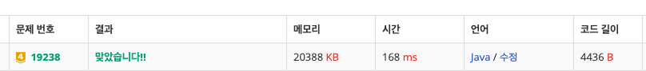

# 19238\_스타트택시







```text

import java.io.*;
import java.util.*;

public class Main{
	static int N, M, fuel;
	static int[][] map;
	static List<Info> list;

	// 탑승객 정보
	static class Info {
		int x, y, fx, fy;

		public Info(int x, int y, int fx, int fy) {
			this.x = x;
			this.y = y;
			this.fx = fx;
			this.fy = fy;
		}
	}

	// 택시와의 거리
	static class Node implements Comparable<Node> {
		int x, y, dist;

		public Node(int x, int y, int dist) {
			this.x = x;
			this.y = y;
			this.dist = dist;
		}

		@Override
		public int compareTo(Node o) {
			if (this.dist != o.dist)
				return this.dist - o.dist;
			else {
				if (this.x != o.x)
					return this.x - o.x;
				else
					return this.y - o.y;
			}
		}
	}

	static int[][] dxy = { { -1, 0 }, { 1, 0 }, { 0, -1 }, { 0, 1 } };
	static List<Node> guest;

	public static void main(String[] args) throws IOException {
		BufferedReader br = new BufferedReader(new InputStreamReader(System.in));
		StringTokenizer st = new StringTokenizer(br.readLine());
		N = Integer.parseInt(st.nextToken());
		M = Integer.parseInt(st.nextToken());
		fuel = Integer.parseInt(st.nextToken());
		list = new ArrayList<>();
		map = new int[N][N];
		for (int i = 0; i < N; i++) {
			st = new StringTokenizer(br.readLine());
			for (int j = 0; j < N; j++) {
				map[i][j] = Integer.parseInt(st.nextToken());
				if (map[i][j] == 1) {
					map[i][j] = -1;
				}
			}
		}
		st = new StringTokenizer(br.readLine());
		int dx = Integer.parseInt(st.nextToken())-1; // 택시 정보
		int dy = Integer.parseInt(st.nextToken())-1;

		for (int i = 0; i < M; i++) {
			st = new StringTokenizer(br.readLine());
			int x = Integer.parseInt(st.nextToken())-1;
			int y = Integer.parseInt(st.nextToken())-1;
			int fx = Integer.parseInt(st.nextToken())-1;
			int fy = Integer.parseInt(st.nextToken())-1;
			map[x][y] = i + 1;
			list.add(new Info(x, y, fx, fy));
		}
		while (true) {
			if (list.size() == 0) { // 손님을 다 태우고 끝!
				System.out.println(fuel);
				return;
			}
			guest = new LinkedList<>();
			find(dx, dy);
			if (guest.size() == 0) { // 손님이 없거나 갈수없다면 끝
				System.out.println(-1);
				return;
			}
			// 손님이 있다면
			Node cur = guest.get(0);
			map[cur.x][cur.y] = 0; // 손님 위치 지우기
			fuel -= cur.dist;
			if (fuel < 0) { // 연료부족시 끝
				System.out.println(-1);
				return;
			}

			// 승객위치까지 왔으니 도착지 까지 도달하기
			int dist = 0;
			for (int i = 0; i < list.size(); i++) {
				// 승객 찾기
				Info info = list.get(i);
				if (info.x == cur.x && info.y == cur.y) {
					// 도착지까지 거리 구하기
					dist = getDist(info.x, info.y, info.fx, info.fy);
					if (dist == -1) { // 못간다면
						System.out.println(-1);
						return;
					}
					// 갈수 있다면 택시 위치 바꾸고 정보지우기
					dx = info.fx;
					dy = info.fy;
					list.remove(info);
					break;

				}
			}
			fuel -= dist;
			if (fuel < 0) {
				System.out.println(-1);
				return;
			}
			fuel += dist * 2;

		}

	}

	// 최단거리 구하기
	static void find(int x, int y) { // 택시기사 현위치
		PriorityQueue<Node> pq = new PriorityQueue<>();
		boolean[][] visited = new boolean[N][N];
		pq.add(new Node(x, y, 0));
		visited[x][y] = true;
		while (!pq.isEmpty()) {
			Node cur = pq.poll();
			if (map[cur.x][cur.y] >= 1) { // 손님이 있다면
				guest.add(new Node(cur.x, cur.y, cur.dist));
				return;
			}
			for (int k = 0; k < 4; k++) {
				int nx = cur.x + dxy[k][0];
				int ny = cur.y + dxy[k][1];

				if (!isRange(nx, ny) || visited[nx][ny] || map[nx][ny] == -1)
					continue;
				visited[nx][ny] = true;
				pq.add(new Node(nx, ny, cur.dist + 1));
			}

		}
	}

	static int getDist(int x, int y, int fx, int fy) {
		Queue<Node> que = new LinkedList<>();
		que.add(new Node(x, y, 0));
		boolean[][] visited = new boolean[N][N];
		visited[x][y] = true;
		while (!que.isEmpty()) {
			Node cur = que.poll();
			if (cur.x == fx && cur.y == fy) {
				return cur.dist;
			}
			for (int k = 0; k < 4; k++) {
				int nx = cur.x + dxy[k][0];
				int ny = cur.y + dxy[k][1];

				if (!isRange(nx, ny) || visited[nx][ny] || map[nx][ny] == -1)
					continue;
				visited[nx][ny] = true;
				que.add(new Node(nx, ny, cur.dist + 1));
			}

		}
		return -1;
	}

	static boolean isRange(int x, int y) {
		if (x < 0 || x >= N || y < 0 || y >= N)
			return false;
		else
			return true;
	}

}

```

