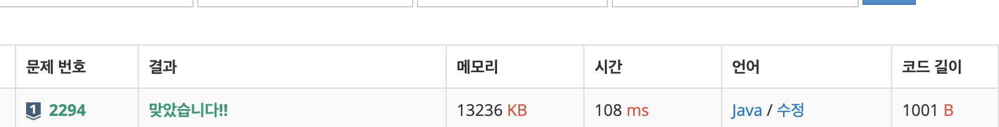

# 2294\_동전2

DP





```text

import java.io.BufferedReader;
import java.io.IOException;
import java.io.InputStreamReader;
import java.util.Arrays;
import java.util.StringTokenizer;

public class Main_2294_동전2 {

	public static void main(String[] args) throws IOException {
		BufferedReader br = new BufferedReader(new InputStreamReader(System.in));
		StringTokenizer st = new StringTokenizer(br.readLine());
		int n = Integer.parseInt(st.nextToken());
		int k = Integer.parseInt(st.nextToken());
		int[] coin = new int[n + 1];
		int[] sum = new int[k+1];
		for (int i = 0; i < n; i++) {
			coin[i] = Integer.parseInt(br.readLine());
		}

		for (int i = 0; i < n; i++) {
			int cur = coin[i]; // 현재 동전
			for (int j = cur; j <= k; j++) {
				if(j == cur) {
					sum[j] = 1;
					continue;
				}
				//체크되지 않는 조합이거나 해당 조합이 최소값일 경우 
				if((sum[j]==0 || sum[j]>=sum[j-cur]+1) &&sum[j-cur]!=0) {
					sum[j] = sum[j-cur]+1;
				}
			}
			//System.out.println(Arrays.toString(sum));
		}
		System.out.println(sum[k]==0?-1 : sum[k]);

	}

}

```


이렇게 바꿔도 결과는 같음!

```text
for(int coin : coins) {
			for(int i=coin;i<=K;i++) {
				dp[i]=Math.min(dp[i], dp[i-coin]+1);
			}
		}
```


