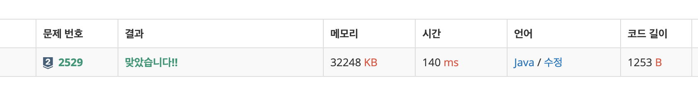

# 2529\_부등호






> ```text
> package _8월2주차;
> import java.io.BufferedReader; import java.io.InputStreamReader; import java.util.ArrayList;
> public class Main2529부등호 {
>  // 위상정렬 // 백트레킹
> static int N;
> static boolean[] check = new boolean[10];
> static char[] input;
> static ArrayList<String> answer = new ArrayList<>();
>
> public static void main(String[] args) throws Exception {
>     BufferedReader br = new BufferedReader(new InputStreamReader(System.in));
>     N = Integer.parseInt(br.readLine());
>     check = new boolean[10];
>
>     input = new char[N];
>     String[] temp = br.readLine().split(" ");
>     for (int i = 0; i < N; i++) {
>         input[i] = temp[i].charAt(0);
>     }
>
>     solve(0, "");
>     // 최대와 최소 뽑기
>     System.out.println(answer.get(answer.size() - 1));
>     System.out.println(answer.get(0));
>
> }
>
> private static void solve(int idx, String num) {
>     if (idx == N + 1) {
>         answer.add(num);
>         return;
>     }
>     for (int i = 0; i <= 9; i++) {
>         if (check[i])
>             continue;
>         if (idx == 0 || find(num.charAt(idx - 1), (char) (i + '0'), input[idx - 1])) {
>             check[i] = true;
>             solve(idx + 1, num + Integer.toString(i));
>             check[i] = false;
>
>         }
>     }
> }
>
> private static boolean find(char a, char b, char oper) {
>     if (oper == '<') {
>         if (a > b)
>             return false;
>     }
>     if (oper == '>')
>         if (a < b)
>             return false;
>     return true;
> }
> ```
>
> }

